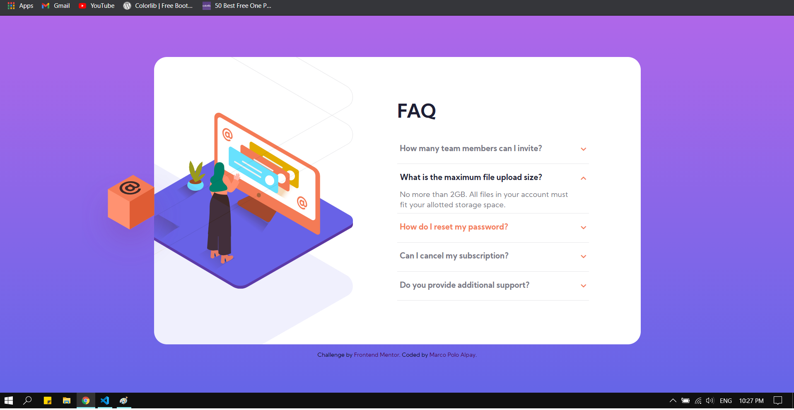
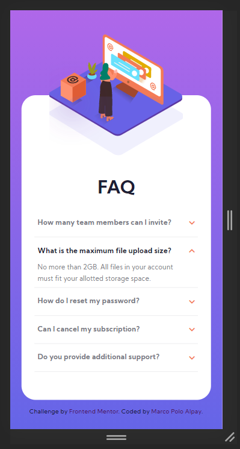

# Frontend Mentor - FAQ accordion card solution

This is a solution to the [FAQ accordion card challenge on Frontend Mentor](https://www.frontendmentor.io/challenges/faq-accordion-card-XlyjD0Oam). Frontend Mentor challenges help you improve your coding skills by building realistic projects. 

## Table of contents

- [Overview](#overview)
  - [The challenge](#the-challenge)
  - [Screenshot](#screenshot)
  - [Links](#links)
- [My process](#my-process)
  - [Built with](#built-with)
  - [What I learned](#what-i-learned)
- [Author](#author)

## Overview

### The challenge

Users should be able to:

- View the optimal layout for the component depending on their device's screen size
- See hover states for all interactive elements on the page
- Hide/Show the answer to a question when the question is clicked

### Screenshot




### Links

- Solution URL: [Add solution URL here](https://your-solution-url.com)
- Live Site URL: [Add live site URL here](https://your-live-site-url.com)

## My process

### Built with

- Semantic HTML5 markup
- Sass
- JavaScript
- Flexbox
- CSS Grid
- Mobile-first workflow

### What I learned

I have learned how to add and position multiple images on background. I also learned how to dynamically add a list of elements using the map() method.

```js
const questions = data.map((item) => {
  return `
	<article class="question">
		<header>
			<h3 class="toggle hover">${item.question}</h3>
			<i class="fas fa-chevron-down arrow toggle"></i>
		</header>
		<p class='answer'>${item.answer}</p>
	</article>
	<div class="underline"></div>`;
});
```

I added the eventListeners dynamically too by using forEach() method.

```js
toggles.forEach((item) => {
  item.addEventListener("click", (e) => {
    const header = e.target.parentNode;
    const article = header.parentNode;
    const box = document.querySelector(".box-icon");
    article.classList.toggle("active");
    if (article.classList.contains("active")) {
      box.style.transform = "translateX(-45px)";
    } else {
      box.style.transform = "translateX(0px)";
    }
  });
});
```

## Author

- Frontend Mentor - [@devMarco02](https://www.frontendmentor.io/profile/devMarco02)

